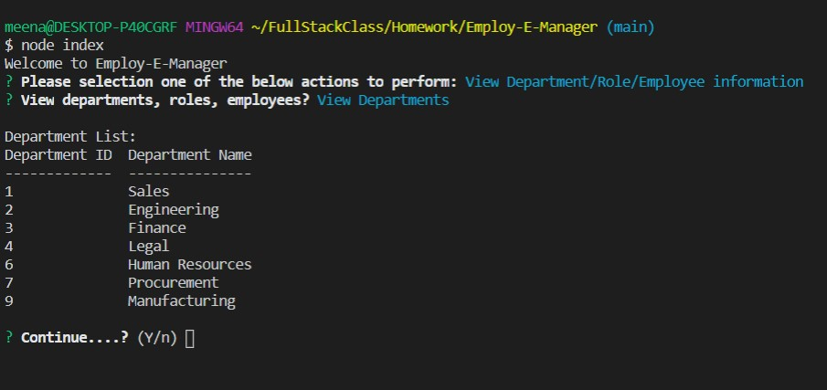
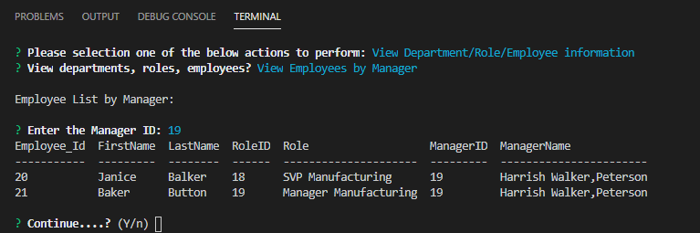

# Employ-E-Manager

## Table of contents:

1. [Description](#description)

2. [Install Guide](#install)

3. [Usage](#usage)

4. [Contribute](#contribute)

5. [license](#license)

6. [screenshot](#screenshot)

7. [URL](#url)
        
<div id="description"/>
        
## Description:
```
Employ-E-Manager is a Content management System application, that helps with managing company's employees, and their role and department.
```
        
<div id="install"/>
        
## Installation Instruction:
```
Node, Inquirer, console.table and MySQL. The application is dependent on "Node" CLI. Dependent on "Inquirer" for prompting users with option to add, update and delete department, role and employee information. The data is stored in MySQL database, so it required a installation of "mysql". The "console.table" installation is necessary to view the results in the better formatted display, compared to console.log of the database resultSet.
```
        
<div id="usage"/>
        
## Usage:
```
The application can be started by "node index". Options to add, delete, update roles/departments/employees will be presented. As appropriate responses are provided, the data will be added/updated/deleted to/from the database. Other options to view the data also is presented and the resultSet will be displayed. Additional option to go back to MainMenu or AddMenu or ViewMenu are presented, so the user can do all their operation without having to kick off the "node index" for each and every operation.
```
        
<div id="contribute"/>
        
## How to Contribute:
```
N/A
```
        
<div id="license"/>
        
## License:
```
N/A
```
        
<div id="screenshot"/>
        
## Screenshot:

<ins>1) Main Menu CLI screenshot:</ins>


<ins>2) View Department Resultset:</ins>




<ins>3) View Employee Resultset:</ins>


<ins>4) View Employee by Manager Resultset:</ins>



<ins>5) View Utilized Budget by Department Resultset:</ins>


<ins>6) Ending CLI:</ins>


        
<div id="url"/>
        

## URLs:

GitHub Repository: [[https://github.com/meenaambalam/Employ-E-Manager]](https://github.com/meenaambalam/Employ-E-Manager)

Application Demo Video: [[https://youtu.be/_t61Axo9b2k]](https://youtu.be/_t61Axo9b2k)

Please contact meenaambalam at [meena.a.ambalam@gmail.com](mailto:meena.a.ambalam@gmail.com?subject=Github) in case of any questions with the application or instruction.